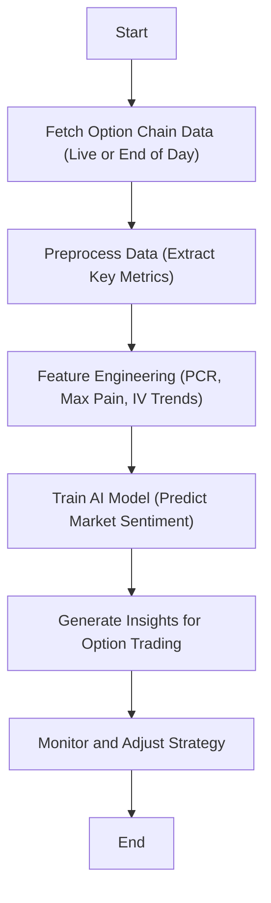

# ai-trading-bot
Creating an AI trading bot that leverages option chain data to predict market trends is an excellent and advanced idea.

## Objective
Using option chain data (strike prices, open interest, implied volatility, etc.) to predict market trends specifically for options trading. 
**Users**: Option traders aiming to identify bullish or bearish trends. 
**Output**: Predictions such as:
- Bullish/Bearish market sentiment.
- Expected price movement direction.

## Understanding Option Chain Data
Key Option Chain Metrics:

- **Strike Price (SP)**: The price at which the holder can buy (call) or sell (put) the underlying asset
- **Open Interest (OI)**: The total number of open contracts for a strike price
- **Implied Volatility (IV)**: Market's forecast of a likely movement in the price
- **Put-Call Ratio (PCR)**: PCR = Total Put Open Interest / Total Call Open Interest
     - PCR > 1: Bearish sentiment
     - PCR < 1: Bullish sentiment
- **Max Pain**: The strike price where the greatest number of options expire worthless, indicating possible price convergence.

## Planning the Bot Workflow
AI Trading Bot Workflow

## Data Sources

Option Chain Data Providers:
- **NSE (India): Provides real-time option chain data for Indian markets**
- **Google Finance**
- **Alpha Vantage Options API: Historical data**

Data Structure Example:

|**Strike Price**| **Call OI** |	**Call IV** |	**Put OI** |	**Put IV** |	**Underlying Price** |
|----------------|--------------|-------------|-------------|-------------|-----------------------|
|17500 |	12000 |	25% |	8000 |	30% |	17450 |
|17600 |	15000	|27% |	10000 |	32% |	17450 |

## Featured Engineering

Features Derived from Option Chain:
- **Open Interest Change**: Measure of buying/selling activity
- **OI Change** = OI Today − OI Yesterday
- **Put-Call Ratio (PCR)**: Market sentiment indicator
- **IV Skew**: Difference in IV across strike prices
- **Max Pain**: Strike price convergence
- **Time-Series Features**:
   - Historical trends in OI and IV over time
   - PCR patterns over intraday periods

## Model Training
- **Input Features**: Strike prices, OI, IV, PCR, max pain, historical trends
- **Model**: Uses a classification or regression model
- **Classification**: Predicts bullish/bearish market sentiment
- **Regression**: Predicts underlying asset price movement
- **Potential Models**:
    - Random Forests or Gradient Boosting for initial experimentation
    - LSTMs or Transformers for time-series analysis

## Prediction Output
- **Market Sentiment**: Bullish/Bearish prediction based on PCR, IV trends
- **Target Levels**: Expected price movement based on option chain data
- **Trading Insights**:
   - Entry/Exit levels for option trades
   - Strike prices with highest probability of profitability

## Monitoring and Improvement
- **Backtest Strategy**: Use historical option chain data to validate model predictions
- **Risk Management Rules**:
    - Limit exposure by setting stop-loss and target-profit levels
    - Avoid trades in low-volume strike prices.
- **Live Testing**: Simulate predictions in real markets before deployment
